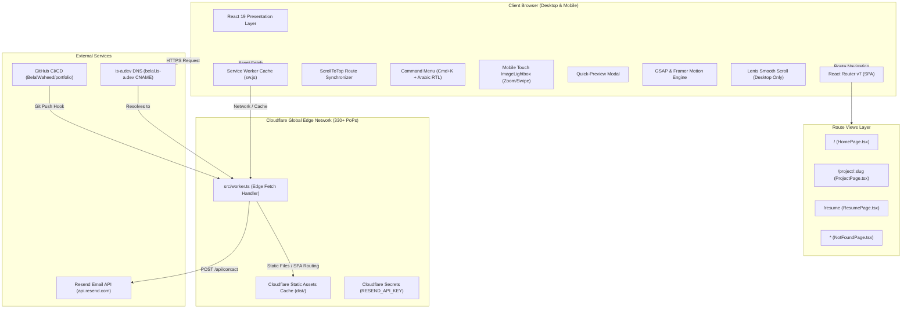

# System Architecture & Layer Breakdown

## 1. High-Level Component & Edge Architecture

---

## 2. Layer Responsibilities & Boundaries

### 1. Presentation & Routing Layer (`src/pages/`, `src/components/`)
- **Pages**:
  - `HomePage.tsx`: Main showcase featuring Hero (with dedicated mobile WebP avatar), About, Bento Projects, Skills, and Contact form.
  - `ProjectPage.tsx`: Dedicated full-canvas case study page with interactive tabs (System Architecture, Engineering Challenges, Tech Stack Matrix, Performance Benchmarks), HD video player, and tap-to-expand image galleries.
  - `ResumePage.tsx`: Interactive, printable resume with ATS-friendly layout and PDF export.
  - `NotFoundPage.tsx`: Themed 404 fallback with single-click return navigation.
- **Components**:
  - `ImageLightbox.tsx`: Mobile-first touch swipe lightbox supporting pinch/zoom, 48px touch targets, full-screen zoom, keyboard arrow navigation, and thumbnail strip.
  - `Projects.tsx`: Bento grid with technology filters and dual action buttons (Direct Case Study ↗ and Quick Preview).
  - `ProjectModal.tsx`: Lightweight modal quick-view with direct link to full case study.
  - `CommandMenu.tsx`: Global `Cmd+K` palette indexing all sections, case studies, and quick actions with automatic Arabic / RTL script handling.
  - `Input.tsx` & `Textarea.tsx`: Native bidirectional inputs with automatic RTL detection (`dir="auto"`).

### 2. Animation, Scrolling & Performance Engine (`src/App.tsx`, `src/index.css`)
- **Scroll Restoration (`ScrollToTop`)**: Hooks into React Router location changes to ensure viewports instantly reset to top on navigation.
- **IntersectionObserver Navigation**: Replaced scroll calculation reflows with zero-overhead `IntersectionObserver` in Header.
- **Direct DOM Cursor Transforms**: `CustomCursor.tsx` drives translation via `requestAnimationFrame` with 0% React re-render overhead.
- **Lenis Smooth Scrolling**: Initialized strictly on non-touch desktop viewports (`window.matchMedia('(pointer: fine)').matches`) to eliminate touch lag on mobile devices.
- **GSAP Ticker Sync**: `lenis.on('scroll', ScrollTrigger.update)` keeps ScrollTrigger measurements perfectly synchronized with hardware refresh rates.
- **Framer Motion**: Manages declarative layout animations (`layoutId="project-tab-pill"`, `layoutId="nav-indicator"`, Bento grid filter filtering, and modal popups).

### 3. PWA, Structured Data & Edge Layer (`src/worker.ts`, `public/`)
- **Service Worker (`sw.js`)**: Production caching strategy for ultra-fast offline loads and asset caching.
- **Web App Manifest (`manifest.webmanifest`)**: Provides installable PWA experience on iOS and Android.
- **Schema.org Structured Data**: Embedded `WebApplication` JSON-LD for AI search engines (ChatGPT Search, Perplexity, Google SGE).
- **Worker Fetch Interceptor**: Intercepts `POST /api/contact` requests, validates request payload (`name`, `email`, `subject`, `message`), and securely communicates with Resend using server-side `env.RESEND_API_KEY`.
- **Static Assets Binding**: Uses `env.ASSETS.fetch(request)` with `"not_found_handling": "single-page-application"` to serve all SPA routes (`/`, `/project/:slug`, `/resume`) and 3x retina media with zero latency.

