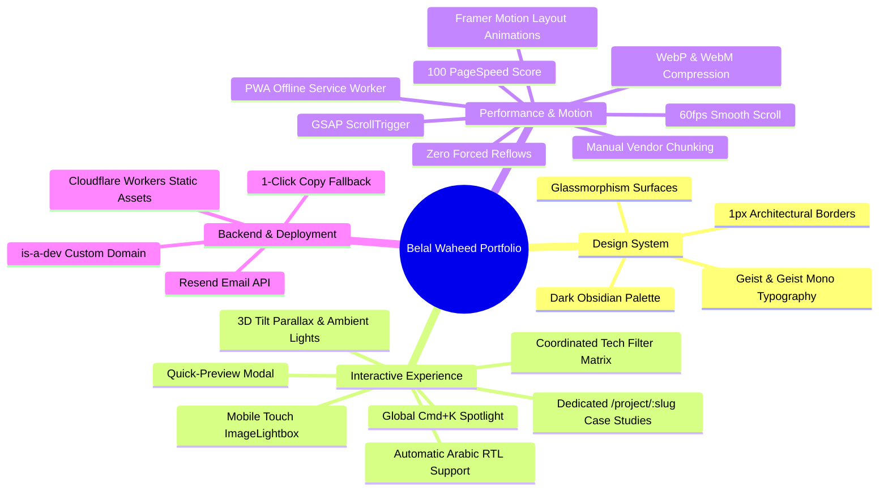

# Belal Waheed — Developer Portfolio Overview

## 1. Product Vision
The goal of this project is to create an inspiring, high-craft, buttery-smooth personal portfolio for **Belal Waheed (Full-Stack Software Engineer)** that feels state-of-the-art and completely avoids generic AI clichés (purple neon gradients, textureless surfaces, emoji clutter).

---

## 2. Core Pillars & Design Aesthetics

| Pillar | Implementation | Rationale |
| :--- | :--- | :--- |
| **Dark Obsidian Palette** | `#09090b` canvas, `#121215` surfaces, Emerald (`#10b981`), Amber (`#f59e0b`), Cyan (`#06b6d4`) | Provides high contrast (WCAG AAA compliant), professional architectural depth, and zero neon clichés. |
| **Dedicated Case Study Routes** | Dynamic `/project/:slug` routes with tabbed engineering deep-dives | Allows recruiters and engineers to bookmark and share specific project case studies with full architectural diagrams and benchmarks. |
| **Fullscreen Mobile Lightbox** | Touch swipe gestures, 48px touch targets, full-screen zoom, keyboard arrows | Delivers buttery-smooth native app feel on smartphones and tablets. |
| **Ergonomic Typography** | *Geist* display headings + *Geist Mono* metadata + *Inter* body copy | Maximizes technical readability and establishes clear information hierarchy. |
| **Zero-Friction Access** | Global `Cmd+K` / `Ctrl+K` Spotlight + 1-Click Clipboard Copy | Allows recruiters and engineering leaders to find projects, download resumes, or copy contact info in 1 keystroke. |
| **Dual-Presentation Resume** | Interactive digital CV + `@media print` black-and-white 1-page PDF export | Solves both digital browsing and physical/PDF ATS export needs seamlessly. |
| **PageSpeed 100 & PWA** | WebP/WebM assets, `sw.js` cache, zero layout thrashing, Web App Manifest | Ultra-fast initial load times (<300ms) with full offline reliability. |

---

## 3. Technology Stack Matrix

- **Frontend**: React 19, TypeScript, Vite 8, Rolldown / Babel React Compiler
- **Styling**: Tailwind CSS v4 (`@theme` tokens in `src/index.css`)
- **Animation & Scrolling**: GSAP 3.x, ScrollTrigger, Framer Motion, Lenis
- **UX & Media**: Custom Touch ImageLightbox, WebP/WebM video players, Lucide React icons
- **Routing**: React Router v7 with SPA routing and ScrollToTop restoration
- **PWA & Structured Data**: Service Worker (`sw.js`), Web App Manifest, Schema.org `WebApplication` JSON-LD
- **Serverless & Edge**: Cloudflare Workers (`src/worker.ts`), Vercel Serverless Function (`api/contact.ts`), Resend Email API
- **Live Domains**: `belal.is-a.dev` (Primary CNAME), `belalwaheed.pages.dev`, `portfolio.belwaheed.workers.dev`

