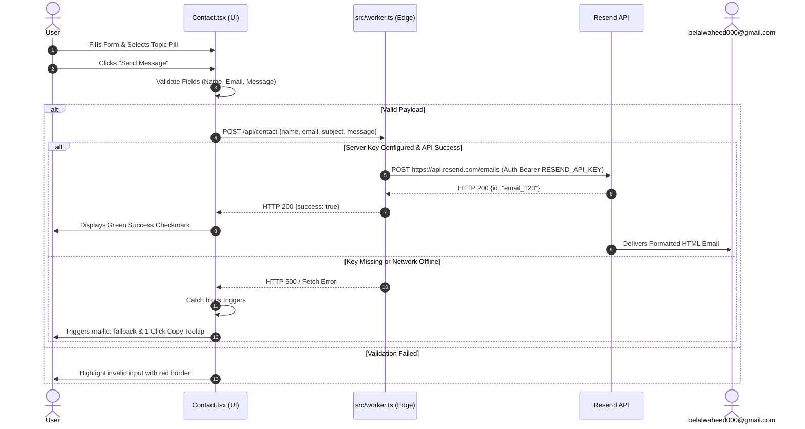
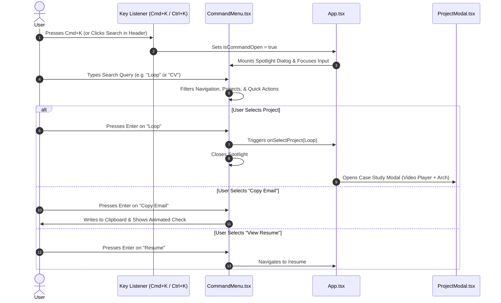
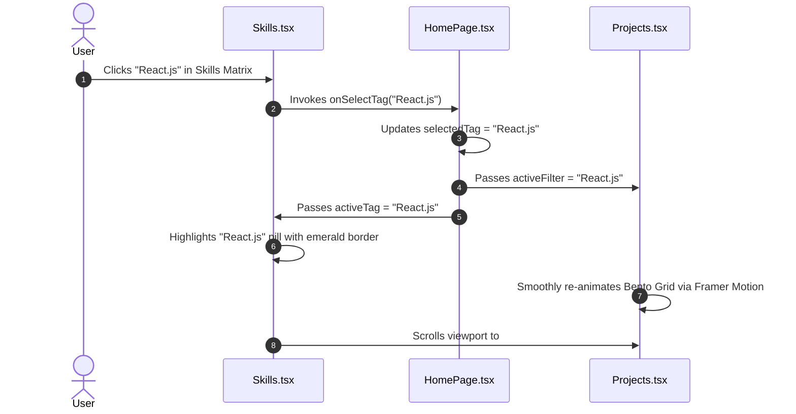
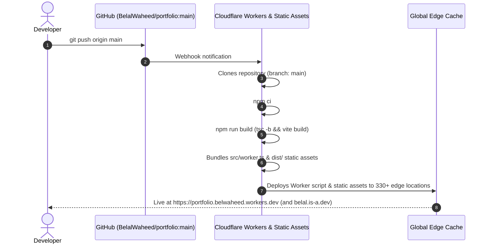

# System Workflows & Data Flows

## 1. Contact Form Dispatch & Fail-Safe Fallback Flow

---

## 2. Command Menu (`Cmd+K`) Navigation & Spotlight Workflow

---

## 3. Coordinated Technology Filter Workflow

---

## 4. Git-Driven Cloudflare Deployment Workflow

