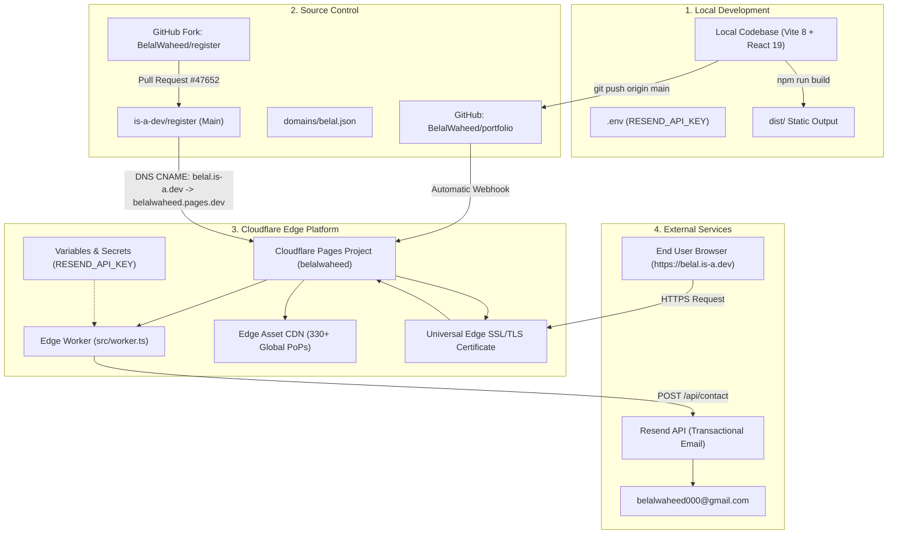

# Master Zero-to-Finish Deployment & Custom Domain Guide

> [!ABSTRACT] Complete End-to-End Runbook
> This document is the definitive master runbook for deploying the **Belal Waheed Developer Portfolio** from a clean repository to a globally edge-cached production website with a free custom domain (`https://belal.is-a.dev`), automated SSL/TLS encryption, and serverless Resend email dispatch.

---

## 1. System Architecture & Lifecycle Diagram



---

## 2. Phase-by-Phase Implementation Runbook

### Phase 1: Local Project Build Configuration

1. **Verify Root Configuration (`wrangler.jsonc`)**:
   ```jsonc
   {
     "$schema": "node_modules/wrangler/config-schema.json",
     "name": "belalwaheed",
     "main": "src/worker.ts",
     "compatibility_date": "2026-08-17",
     "observability": {
       "enabled": true
     },
     "assets": {
       "directory": "./dist",
       "binding": "ASSETS",
       "not_found_handling": "single-page-application"
     }
   }
   ```

2. **Verify Edge Worker (`src/worker.ts`)**:
   - Handles `POST /api/contact` requests with CORS headers and `OPTIONS` preflight responses.
   - Forwards transactional messages to Resend via `https://api.resend.com/emails`.
   - Serves all SPA static frontend routes (`/`, `/project/:slug`, `/resume`) via `env.ASSETS.fetch(request)`.

3. **Verify Build Output**:
   ```bash
   pwsh -NoProfile -Command "npm run lint; npm run build"
   ```
   *Expected output: Zero ESLint errors, Vite builds static assets into `dist/`.*

---

### Phase 2: Cloudflare Pages Deployment

1. **Log into Cloudflare**: Navigate to **[dash.cloudflare.com](https://dash.cloudflare.com/)**.
2. **Create Project**:
   - Go to **Workers & Pages** ➔ **Create application** ➔ **Pages** tab.
   - Select **Connect to Git** ➔ Authorize your GitHub account ➔ Select your repository **`portfolio`** (or `belalwaheed-vercel`).
3. **Configure Build Settings**:
   - **Project Name**: `belalwaheed`
   - **Framework Preset**: `Vite`
   - **Build Command**: `npm run build`
   - **Build Output Directory**: `dist`
4. **Click "Save and Deploy"**:
   - Cloudflare will build the repository and assign a permanent URL:
     👉 `https://belalwaheed.pages.dev`

---

### Phase 3: Resend Email API & Edge Secrets Setup

1. **Create Resend API Key**:
   - Open **[https://resend.com/signup](https://resend.com/signup)** (Sign up with `belalwaheed000@gmail.com`).
   - Go to **API Keys** ➔ **Create API Key**.
   - **Name**: `portfolio-contact`
   - **Permission**: `Full access`
   - **Domain**: `All Domains`
   - Copy the key: `re_f4mo6B3v_...`

2. **Set Local Development Variable (`.env`)**:
   ```env
   RESEND_API_KEY=re_your_resend_api_key_here
   CONTACT_RECEIVER_EMAIL=belalwaheed000@gmail.com
   ```

3. **Set Cloudflare Production Secrets**:
   - On **[dash.cloudflare.com](https://dash.cloudflare.com/)**, go to **Workers & Pages** ➔ **`belalwaheed`**.
   - Navigate to **Settings** ➔ **Variables and Secrets**.
   - Click **Add** under *Environment Variables*:
     - **Variable Name**: `RESEND_API_KEY`
     - **Value**: `re_your_resend_api_key_here` (Check **Encrypt**)
     - **Variable Name**: `CONTACT_RECEIVER_EMAIL`
     - **Value**: `belalwaheed000@gmail.com`
   - Click **Save and Deploy**.

---

### Phase 4: Free Domain Registration via `is-a.dev`

1. **Fork the Registry Repository**:
   - Open **[https://github.com/is-a-dev/register/fork](https://github.com/is-a-dev/register/fork)**.
   - Click **Create fork** to create `https://github.com/BelalWaheed/register`.

2. **Create the Domain Record File (`domains/belal.json`)**:
   - In your forked repository, navigate into the **`domains/`** folder.
   - Click **Add file** ➔ **Create new file**.
   - Set file path: `domains/belal.json`
   - Paste the exact JSON schema:
     ```json
     {
       "owner": {
         "username": "BelalWaheed",
         "email": "belalwaheed000@gmail.com"
       },
       "records": {
         "CNAME": "belalwaheed.pages.dev"
       }
     }
     ```
   - Click **Commit changes...** with commit message: `feat: register belal.is-a.dev`.

3. **Submit the Pull Request**:
   - In your forked repository, click **Contribute** ➔ **Open pull request**.
   - Title: `Register: belal.is-a.dev`.
   - Body:
     - Check the agreement: `[x] I have read the Terms of Service`.
     - Live website URL: `https://belalwaheed.pages.dev`.
     - Attach a screenshot of your live portfolio homepage (required for bot validation).
   - Click **Create pull request**.

4. **Automated CI Validation & Maintainer Merge**:
   - The `is-a-dev` GitHub Actions bot will validate JSON syntax, CNAME target, and availability.
   - Once all automated checks turn green, an `is-a-dev` maintainer merges the PR into upstream `main`.

---

### Phase 5: Binding `belal.is-a.dev` to Cloudflare Pages (PSL Workaround)

> [!IMPORTANT] Why the Cloudflare Dashboard Shows "Transfer DNS Management"
> Because `is-a.dev` is listed on the global **Public Suffix List (PSL)**, Cloudflare's web dashboard mistakenly assumes it is an apex domain needing full nameserver transfer. To bind an `is-a.dev` subdomain to Pages, you must use the Cloudflare API or the official `cf-pages.is-a.dev` tool.

1. **Generate a Cloudflare API Token**:
   - Open **[dash.cloudflare.com/profile/api-tokens](https://dash.cloudflare.com/profile/api-tokens)**.
   - Click **Create Token** ➔ **Create Custom Token** (or select *Cloudflare Pages* template).
   - Set permissions: **Account** ➔ **Cloudflare Pages** ➔ **Edit**.
   - Account Resources: **Include** ➔ **All accounts** (or your account).
   - Click **Continue to summary** ➔ **Create Token** ➔ **Copy token**.

2. **Retrieve Your Cloudflare Account ID**:
   - In your Cloudflare dashboard URL: `https://dash.cloudflare.com/<ACCOUNT_ID>/workers-and-pages`
   - Copy the 32-character hexadecimal string (`e57de00fd2a97a36be6dba5f2559dfb5`).

3. **Execute Domain Binding via Official Web Tool**:
   - Navigate to: 👉 **[https://cf-pages.is-a.dev/](https://cf-pages.is-a.dev/)**
   - Fill in:
     - **Cloudflare Account ID**: `e57de00fd2a97a36be6dba5f2559dfb5`
     - **Cloudflare Pages Project Name**: `belalwaheed`
     - **Your Subdomain**: `belal`
     - **API Token**: *(Your token from Step 1)*
   - Click **Add subdomain**.

*(Alternative via PowerShell / cURL)*:
```powershell
$accountId = "e57de00fd2a97a36be6dba5f2559dfb5"
$apiToken = "YOUR_CLOUDFLARE_API_TOKEN"
$projectName = "belalwaheed"

Invoke-RestMethod -Uri "https://api.cloudflare.com/client/v4/accounts/$accountId/pages/projects/$projectName/domains" `
  -Method Post `
  -Headers @{ "Authorization" = "Bearer $apiToken"; "Content-Type" = "application/json" } `
  -Body '{"name":"belal.is-a.dev"}'
```

---

### Phase 6: SSL/TLS Provisioning & Verification

1. **Automatic Certificate Issuance**:
   - Cloudflare Pages initiates a DNS challenge against the CNAME record.
   - Cloudflare automatically provisions and binds a **Universal SSL/TLS certificate** for `belal.is-a.dev`.
2. **DNS & HTTPS Verification**:
   - Test in your browser: **`https://belal.is-a.dev`**
   - Verify that:
     - SSL lock icon appears in the address bar.
     - Case studies navigate cleanly (`/project/tivaq`, `/project/loop`).
     - Contact form dispatches live emails to `belalwaheed000@gmail.com`.

---

## 3. Summary & Quick Reference

| Resource | Target Value | Purpose |
| :--- | :--- | :--- |
| **Live Primary Domain** | `https://belal.is-a.dev` | Official personal domain |
| **Cloudflare Pages URL** | `https://belalwaheed.pages.dev` | Direct edge origin URL |
| **GitHub Repository** | `https://github.com/BelalWaheed/portfolio` | Full-stack source code |
| **is-a-dev Domain JSON** | `domains/belal.json` in `is-a-dev/register` | Open-source DNS CNAME record |
| **Contact Ingestion Email** | `belalwaheed000@gmail.com` | Primary inbox destination |
| **Cloudflare Project** | `belalwaheed` | Global Edge Workers & Pages |
